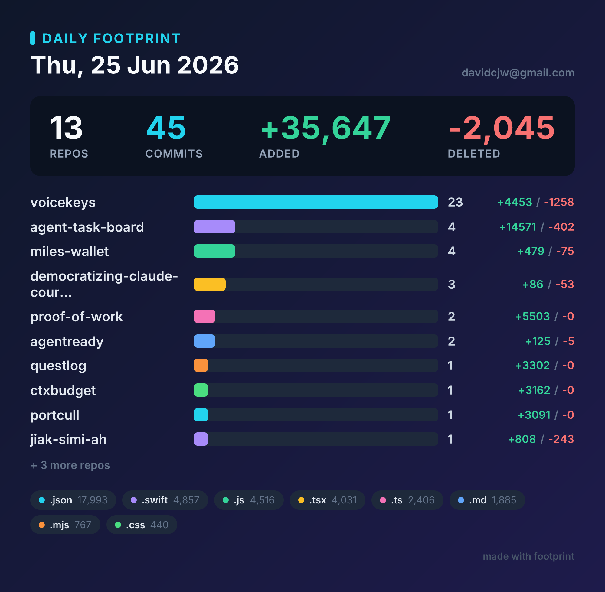
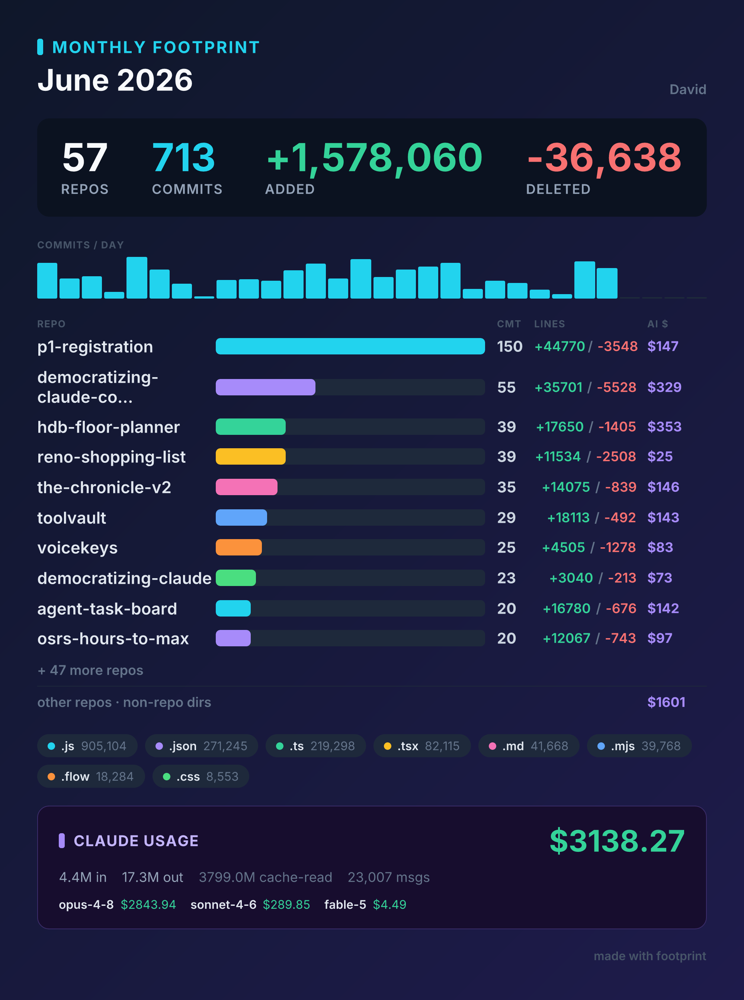

# footprint

[](https://github.com/davidcjw/footprint/actions/workflows/ci.yml)


Summarize the commits you authored **today** across all your local repos — as a
clean terminal report and a shareable PNG card.

> One glance at everything you shipped today, across every repo. Drop the card in
> Slack/Twitter/standup, or pipe the terminal output anywhere.



## Contents

- [What it does](#what-it-does)
- [Usage](#usage)
- [Monthly view](#monthly-view)
- [Options](#options)
- [Token cost tracking](#token-cost-tracking)
- [JSON export](#json-export)
- [How "today" is decided](#how-today-is-decided)
- [Notes](#notes)
- [Contributing](#contributing)
- [Code of Conduct](#code-of-conduct)
- [License](#license)

## What it does

- Scans every git repo directly under a root folder (default `~/code`).
- Finds commits **you** authored on a given local day (matched by your git name/email).
- Aggregates: repos touched, commit counts, lines added/deleted, top languages.
- Tracks **Claude Code token usage and $ cost** for the day from local session
  transcripts (`~/.claude`), broken down by model.
- Prints a colored terminal summary **and** renders a PNG "footprint card".

No services, no API keys, no headless Chrome — the card is rendered with
[`satori`](https://github.com/vercel/satori) + [`@resvg/resvg-js`](https://github.com/yisibl/resvg-js).

## Usage

Requires **Node.js ≥ 20**.

```bash
npm install

# today, repos under ~/code
npm run footprint

# a specific day, open the card when done
npm run footprint -- --date 2026-06-25 --open

# whole month (current month, or a specific one)
npm run footprint -- --month
npm run footprint -- --month 2026-06
```

### Monthly view

`--month` aggregates the whole calendar month instead of a single day. The card
swaps in a **COMMITS / DAY** bar strip (one bar per day of the month) and the
title becomes "Monthly Footprint"; everything else — repo table, per-repo AI $,
language chips, Claude usage band — works the same over the month's window.
Monthly cards are written as `footprint-month-<YYYY-MM>.png`.



Or install the CLI globally:

```bash
npm link          # then `footprint` is on your PATH
footprint --open
```

The card is written to `./out/footprint-<date>.png`.

## Options

| Flag | Default | Description |
|------|---------|-------------|
| `--root <dir>` | `~/code` | Folder containing your repos (immediate children) |
| `--author <s>` | git global `user.email` | Match author name/email. Repeatable (OR-ed) |
| `--date <YMD>` | today (local) | Target day, e.g. `2026-06-25` |
| `--month [YM]` | — | Whole month, e.g. `2026-06`; bare `--month` = current month |
| `--out <dir>` | `./out` | Where to write the PNG card |
| `--no-card` | — | Terminal summary only, skip rendering |
| `--open` | — | Open the PNG after rendering (macOS) |
| `--no-usage` | — | Skip Claude Code token/cost tracking |
| `--json [file]` | — | Emit structured JSON. Bare flag → stdout (pipeable); with a path → write that file alongside the normal output |
| `--claude-dir <d>` | `~/.claude` | Claude Code data dir (where session transcripts live) |
| `-h, --help` | — | Show help |

## Token cost tracking

footprint reads Claude Code's local session transcripts (`~/.claude/projects/**/*.jsonl`),
sums the `usage` of every assistant message authored on the target day, and prices
it per model:

- input / output tokens at each model's published per-MTok rate
- cache **reads** at 0.1×, 5-min cache **writes** at 1.25×, 1-hour writes at 2× the input rate

Models without a known price are still counted (tokens) and flagged `(unpriced)`
with `$0`. Pricing lives in `src/pricing.ts` — update it when rates change.

## JSON export

`--json` emits the same data the card and terminal report are built from, as
structured JSON — so you can pipe a day or month into `jq`, a notebook, Datasette,
Grafana, or whatever you already use.

```bash
# pure JSON to stdout (no terminal report, no card) — pipe it anywhere
footprint --month --json | jq '.usage.byRepo'

# write a file and keep the normal terminal output
footprint --json out/footprint.json
```

The shape is stable and versioned (`schemaVersion`). Top-level keys: `date`,
`period`, `authors`, `totals`, `languages`, `repos[]` (each with its `commits[]`),
`activity[]` (month only), and `usage` (totals, `byModel[]`, and `byRepo[]`).

## How "today" is decided

The target day is a full local-midnight-to-midnight window. Commits are filtered
by git author date (`%aI`) and author identity, so the count matches what you'd
see in your git history — not when changes happened to be pushed.

## Notes

- Only scans **immediate** subdirectories of `--root` that contain a `.git`.
- Merge commits are excluded.
- Bundled font: Inter (SIL Open Font License), in `assets/`.

## Contributing

Contributions are welcome! Please open an issue first to discuss what you'd like to change.

1. Fork the repo
2. Create a feature branch (`git checkout -b feature/your-feature`)
3. Commit your changes (`git commit -m 'feat: describe change'`)
4. Push and open a pull request

Please run `npx tsc --noEmit` and make sure the type check passes before submitting a PR.

## Code of Conduct

This project follows the [Contributor Covenant v2.1](https://www.contributor-covenant.org/version/2/1/code_of_conduct/).
By participating you agree to uphold a welcoming, harassment-free environment.

## License

Distributed under the MIT License. See [LICENSE](LICENSE) for details.
